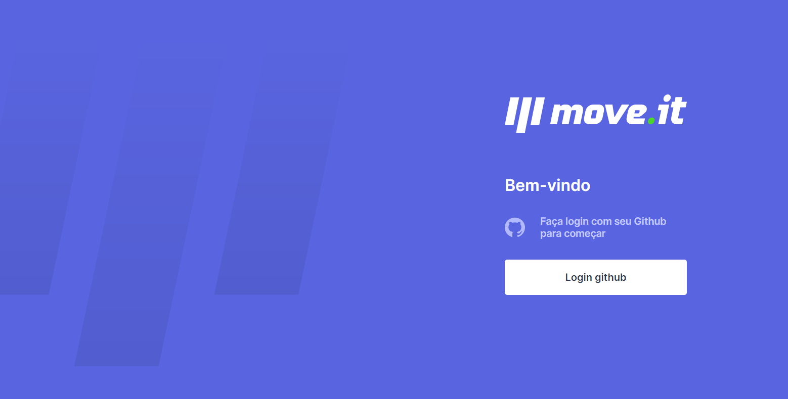
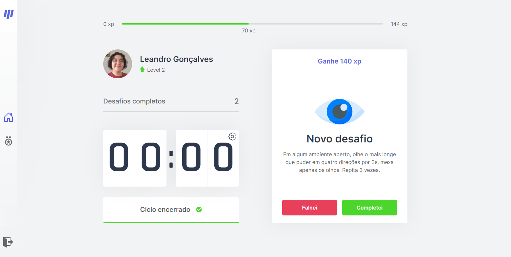
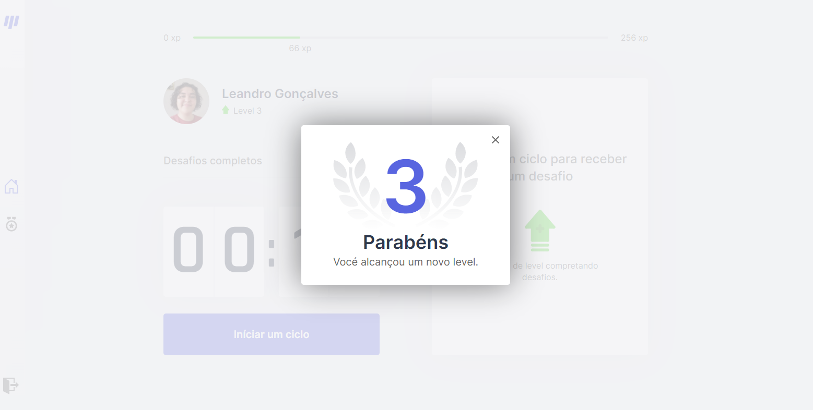
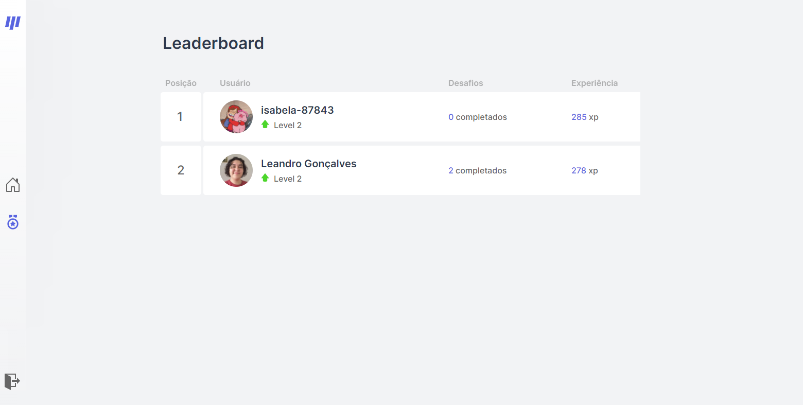
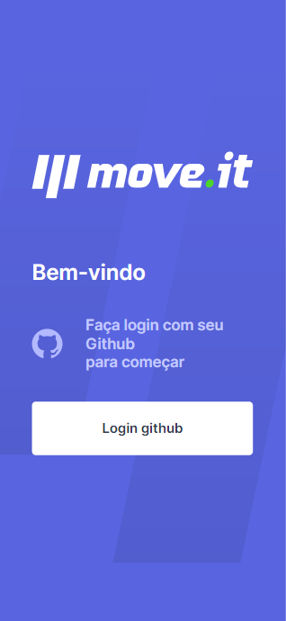
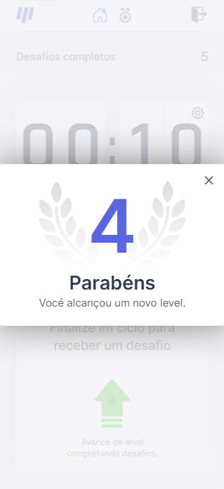
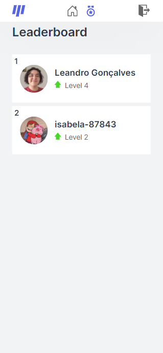

<p align="center">
  
</p>

# Sobre o projeto
  MoveIt é um projeto desenvolvido na [Nlw4](https://github.com/rocketseat-education/nlw-04-reactjs) e modificado adicionando [login](https://next-auth.js.org), [animações](https://www.framer.com/motion/), leanderboard e varias funcionalidades novas.

# Deploy
  Quer ver como o site está sem ter que compilar? É só acessar o link: https://moveit-gules-ten.vercel.app

# Layout web
<p align="center">
  <div style="display: flex; margin-bottom: 30px">
    
    
  </div>
  <div style="display: flex">
    
    
  </div>
</p>

# Layout mobile
<p align="center">
  
  
  
  
</p>

# 🛠 Tecnologias
As seguintes ferramentas foram usadas na construção do projeto:

### front-end

- [axios](https://www.npmjs.com/package/axios)
- [js-cookie](https://www.npmjs.com/package/js-cookie)
- [typescript](https://www.typescriptlang.org)
- [axios](https://www.npmjs.com/package/axios)
- [framer-motion](https://www.npmjs.com/package/framer-motion)
- [next-auth](https://next-auth.js.org)
- [nextjs-progressbar](https://www.npmjs.com/package/nextjs-progressbar)
- [react-icons](https://react-icons.github.io/react-icons/)

### back-end
- [mongodb](https://www.npmjs.com/package/mongodb)


# Back-End
O back-end foi construído em usando serverless seguindo os seguintes caminhos:
* /api
  * /challengesCompleted - troca o numero de desafios completos
  * /currentExperience - troca o numero de experiencia
  * /leaderboard - returna do dados de ranking
  * /levelUp - troca o level
  * /loadChallenge - troca o numero de experiencia
  * /challengesCompleted - troca o numero de desafios completados

# 🚀 Como executar o projeto

💡 Como o back-end está em serverless não é necessário executar nenhuma configuração separada para ele.

## Pré-requisitos
Antes de começar, você vai precisar ter instalado em sua máquina as seguintes ferramentas:

 * [Git](https://git-scm.com)
 * [Node.js](https://nodejs.org)
 * [VSCode](https://code.visualstudio.com) ou outro editor de codigos

## 🧭 Rodando a aplicação

⚠️ Quando clonar a aplicação não se esqueça de:
 - Criar um arquivo .env com os seguintes dados:
   - GITHUB_CLIENT_ID - id do github
   - GITHUB_CLIENT_SECRET - secret do github 
   - NEXTAUTH_URL - url do site
   - AUTH_SECRETS - auth do next
   - JWT_SECRET - jwt secret do next
  

```bash
# Clone este repositório
$ git clone https://github.com/Leandro-Goncalves/moveit
# Acesse a pasta do projeto no seu terminal/cmd
$ cd moveit

# Instale as dependências
$ npm install
# ou
$ yarn

# Execute a aplicação em modo de desenvolvimento
$ npm run start
# ou
$ yarn start

# A aplicação será aberta na porta:3000 - acesse http://localhost:3000
```
---

# Author
Feito com ❤️ por Leandro Gonçalves [Entre em contato!](mailto:leandrogoncalvesprofissional@hotmail.com)

<a href="https://github.com/Leandro-Goncalves/">
  
 <br />
 <sub><b>Leandro Gonçalves</b></sub></a>

---